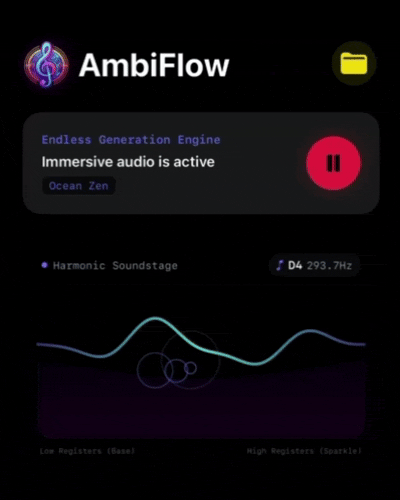
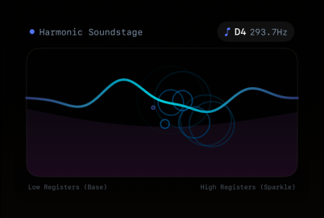
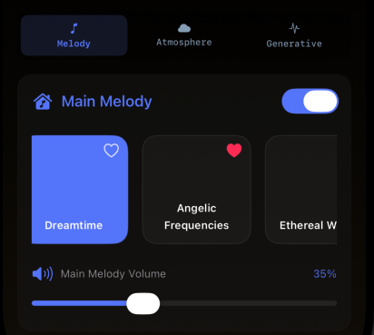
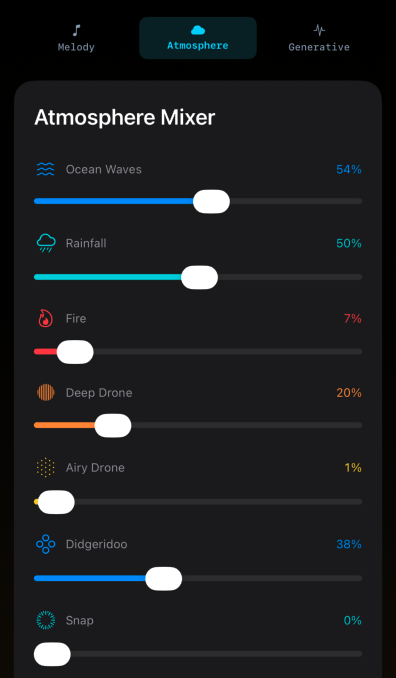
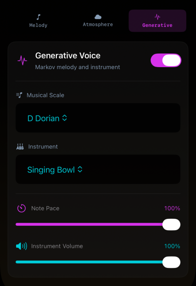
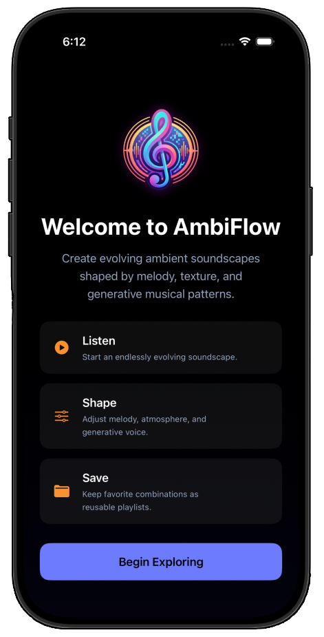
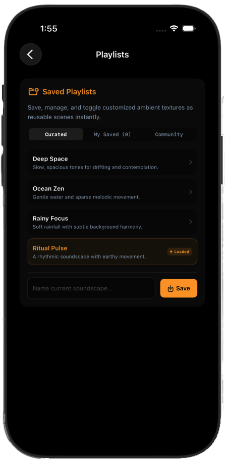

# AmbiFlow

  

  <strong>Generative ambient soundscapes for focus, relaxation, and exploration.</strong>

  <a href="#features">Features</a> ·
  <a href="#screenshots">Screenshots</a> ·
  <a href="#installation">Installation</a> ·
  <a href="#architecture">Architecture</a> ·
  <a href="#roadmap">Roadmap</a>

---

## About AmbiFlow

AmbiFlow is a SwiftUI audio application that creates evolving ambient soundscapes in real time.

It combines looping environmental sounds, generative Markov-based melodies, musical scales, sampled instruments, and animated visualizations to create an immersive listening experience.

The goal of AmbiFlow is to allow users to shape an ambient environment without needing to compose every note manually.

---

## Features

### Generative music

- Markov-chain random walk melody generation.
- Multiple musical scales and moods.
- Adjustable generative note pace.
- Sampled instrument playback using `AVAudioUnitSampler`.
- Generative voice enable/disable control.

### Ambient sound layers

- Ocean waves.
- Rainfall.
- Deep drone.
- Djembe rhythm.
- Shaker texture.
- Individual volume controls for each atmosphere layer.
- Master volume and effect controls.

### Main melody

- Selectable looping base melodies.
- Main melody volume control.
- Melody playback speed control.
- Enable/disable control.

### Visualizations

- Harmonic Soundstage particle visualization.
- Note particles mapped to frequency.
- Continuous waveform reacting to the final mixed audio signal.
- Visual distinction between generative notes and the complete audio mix.
- Animated ambient waveform movement.

### Presets and scenes

- Curated factory presets.
- User-created saved scenes.
- Community soundscapes.
- Preset loading and scene management.
- Current soundscape name displayed in the app header.

### User experience

- Dark, atmospheric visual design.
- First-launch welcome experience.
- Separate playlists screen.
- Melody, atmosphere, and generative control tabs.
- Responsive visual feedback while audio is playing.

---

## Screenshots

<table>
  <tr>
    <td align="center">
       
      <b>Harmonic Soundstage</b>
    </td>
    <td align="center">
       
      <b>Main Melody</b>
    </td>
  </tr>
  <tr>
    <td align="center">
       
      <b>Atmosphere Mixer</b>
    </td>
    <td align="center">
       
      <b>Generative Voice</b>
    </td>
  </tr>
  <tr>
    <td align="center">
        
      <b>Welcome Screen</b>
    </td>
    <td align="center">
       
      <b>Saved Playlists</b>
    </td>
  </tr>
</table>

